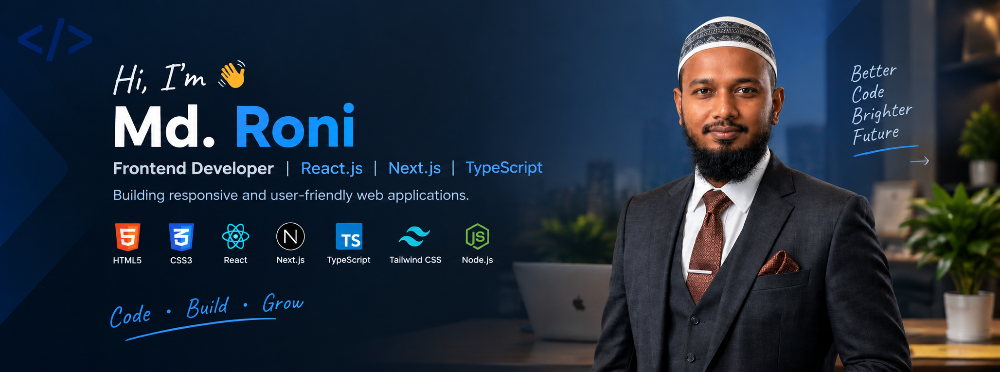

<!--- banner --->

  <!--- title --->

  <ul align="center">
    
<h1 style="display: inline-block"># 👋 Hi, I'm Md. Roni</h1>

    <!--- typo --->
    
  </ul>

### 💻 Frontend Developer | React.js | Next.js | TypeScript

  
  
  

---

## 🌐 About Me

I'm a **Frontend Developer** passionate about building responsive, modern, and user-friendly web applications.

I enjoy turning ideas and designs into clean, functional interfaces using modern frontend technologies. I'm continuously improving my skills through practical projects and hands-on development.

* 🌱 Currently exploring **Next.js, TypeScript, and Advanced React**
* 🔨 Building practical projects with **React.js and Next.js**
* 🎨 Interested in creating **clean and responsive UI**
* 📚 Improving my knowledge of **APIs, data fetching, and modern frontend development**
* 🚀 Working toward becoming a professional **Frontend Developer**
* 📝 I regularly write articles on **[LinkedIn](https://www.linkedin.com/in/md-roni-2034733a2/)**
* 📫 Feel free to reach me out **[Email](mohammadroni0187@gmail.com)**

---

## 🛠️ Skills & Technologies

### 💻 Languages

  
  
  
  

### ⚛️ Frontend

  
  
  

### 🔧 Tools

  
  
  
  
  

---

## 🚀 Featured Projects

### 💻 Tech Stack Manager

A React + TypeScript application that allows users to manage their preferred technologies and build their personal tech stack.

**Key Features**

* ➕ Add technologies to stack
* 🚫 Prevent duplicate technologies
* 🗑️ Remove technologies
* 📱 Responsive user interface

**Tech Stack:** React.js • TypeScript • Tailwind CSS

---

### 🏏 Dream 11 Cricket Team

A React-based cricket team management application where users can select players and build their own Dream 11 team.

**Key Features**

* 🏏 Player selection
* 👥 Team management
* 💰 Player price information
* 📱 Responsive design

**Tech Stack:** React.js • JavaScript • Tailwind CSS

---

### 🌐 Developer Conference Website

A responsive conference website created with HTML, CSS, and JavaScript. The website includes a modern hero section, navigation, event information, and registration-focused UI.

**Tech Stack:** HTML5 • CSS3 • JavaScript

---
## <b> GITHUB STATISTICS & ANALYSIS:</b>

### GitHub Contributions:

<!--- statistics --->
## 📊 GitHub Statistics

  

  

  

---

## 🏆 GitHub Trophies

  

---

## 📈 Contribution Activity

  

---

## 📫 Contact Me

* 📍 **Location:** Dhaka, Bangladesh
* 📧 **[Email](mohammadroni0187@gmail.com)**
* 💼 **[LinkedIn](https://www.linkedin.com/in/md-roni-2034733a2/)**
* 🐙 **[GitHub](https://github.com/mohammadroni0187-arch)**

---

### 🚀 Always Learning. Always Building.

**Thanks for visiting my profile! 👋**

